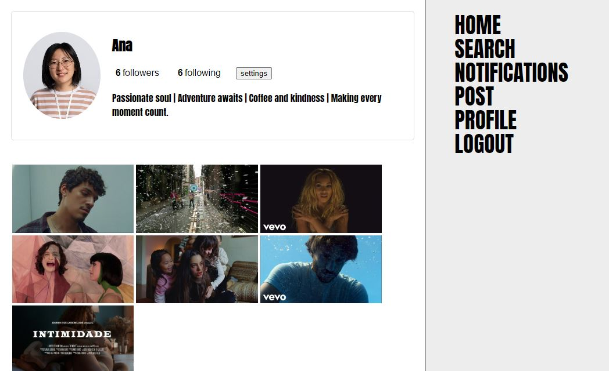

# [Music Hits](https://musichits.surge.sh/)

<p align="center">
  
</p>
<p align="center">
  
</p>


Go to the API Docummentation [here](https://)

## About:
The "Music Hits" project aims to build a fullstack website, with a responsive frontend of a social media plataform to share music videos and its backend applicaction that builds an API with data source for users, posts, likes, and comments. The front-end consists on pages for login and signup, profile page, Home page with all user's posts or friend's posts, and sections to show notifications, search for users and create new posts.


## Functionalities:
- [x]   <strong>Login Page:</strong> The user can connect (if the user and email are valid and previously created) and the app will autenticat the data, and generate an acess token and go to the Home page.
- [x]  <strong>Sign up Page:</strong> The user can creat an account (with email that haven't been used before), and the app will generate an acess token and go to the Home page.
- [x]  <strong>Home page:</strong> Only authorized to be seen if a valid user is logged and the JWT token was generated. The page shows all the posts created by all users OR only the posts of users you follow.
- [x]  <strong>Like or dislike:</strong> The user can like or dislike a post or a comment.
- [x]  <strong>Create post or comment:</strong> The user can create a new post, or can comment on an existing post.
- [x]  <strong>Update or delete post:</strong> The user can update or delete a post only if he/she was the one that created it.
- [x]  <strong>Update profile:</strong> The user can change its name, bio and profile photo.
- [x]  <strong>Notifications:</strong> The user can see if he/she has a new follower or if someone liked its posts.
- [x]  <strong>Searh for users:</strong> The user can search for other users by typing its names on the search field.
- [x]  <strong>Hashed passwords:</strong> All the passwords are hashed using BcryptJS before its storage on the databse, so the information is protected.
- [x]  <strong>Layered Architecture:</strong> The app's backend structure was built and organized with layered architecture to make the code more organized and for its reusability, maintainability and scalability.
- [x]  <strong>Frontend + Api:</strong> Integration with the backend API, using React, axios and endpoints that receives data, based on the API's documentation.
- [x]  <strong>React Router:</strong> Navigation between pages with React Router.
- [x]  <strong>Database:</strong> All the users, posts, comments and likes/dislikes information are storaged on an SQLite database in the backend.

## Front-end deploy:
https://musichits.surge.sh/

## Back-end deploy:
https://musichits-backend.onrender.com


## How to run the back-end project:
The app's back-end is already deployed, but if you want to run the project in your machine, follow these steps:

```bash
# Clone the project's repository (if not already done in the front-end instructions):
    git clone https://github.com/ojoaoneiva/musicHits.git

# Enter the back-end paste:
    cd musicHits
    cd back-end

# Create a ".env" file on the back-end folder, using the instructions on the ".env.example" file:

# Create a database on MySQL and connect to the musicHits.sql file on the back-end folder and activate connection between the sql file and the database:

# Install the app's dependencies:
    npm i

# Run the application in developpement mode:
    npm run dev

# The server will start on localhost:3003
```

## How to run the front-end project:
The app's front-end is already deployed, but if you want to run the project in your machine, follow these steps:

```bash
# Clone the project's repository (if not already done in the back-end instructions):
    git clone https://github.com/ojoaoneiva/musicHits.git

# Enter the front-end paste:
    cd ..
    cd front-end

# Install the app's dependencies:
    npm i

# Run the application:
    npm run start

# The server will start on localhost:3000
```


## Technologies used:
- Node JS
- Typescript
- Express
- SQLite
- Knex
- UUID
- BcryptJS
- JWT
- ZOD
- POO
- Layred Architecture
- React
- Axios
- React Router
- Styled-components

## Images:

<p align="center">
  
    
    
    
    
    
</p>
